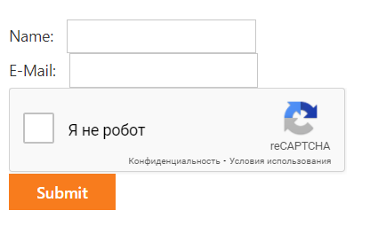

<!-- default badges list -->

<!-- default badges end -->

# How to use Google reCAPTCHA with DevExpress Editors

This example demonstrates how to use [reCAPTCHA API](https://www.google.com/recaptcha/about/) to validate user input.

## Files to Look At

* [Default.aspx](./CS/ReCaptcha/Default.aspx)(VB: [Default.aspx](./VB/ReCaptcha/Default.aspx))

* [Default.aspx.cs](./CS/ReCaptcha/Default.aspx.cs)(VB: [Default.aspx.vb](./VB/ReCaptcha/Default.aspx.vb))

## Implementation Details

Follow the steps below to add **reCAPTCHA** verification to your project:

1. Register your website's domain in the [Google reCAPTCHA](https://www.google.com/recaptcha/admin/create) service to get a pair of a **site key** and **secret key**.

2. Create a `div` container with the **class** attribute set to **g-recaptcha**. Assign the **site key** value to the container's **data-sitekey** attribute.

## Documentation
[reCAPTCHA Documentation](https://developers.google.com/recaptcha/intro)