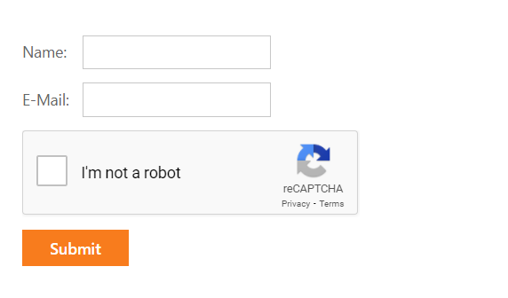

<!-- default badges list -->

<!-- default badges end -->
# How to use ReCaptcha with DevExpress Editors
This example demonstrates how to use ReCaptcha with DevExpress editors to validate user input.

 ## Overview
 To start using reCAPTCHA, you need to [sign up for an API key pair](http://www.google.com/recaptcha/admin) for your site. Then you need to add your site key into "data-sitekey" field of the div with class "g-recaptcha". After that you can use reCaptcha API for further validation. 
## Files to Look At
[Default.aspx](./CS/ReCaptcha/Default.aspx)
## Documentation
[ReCaptcha Documentation](https://developers.google.com/recaptcha/intro)
